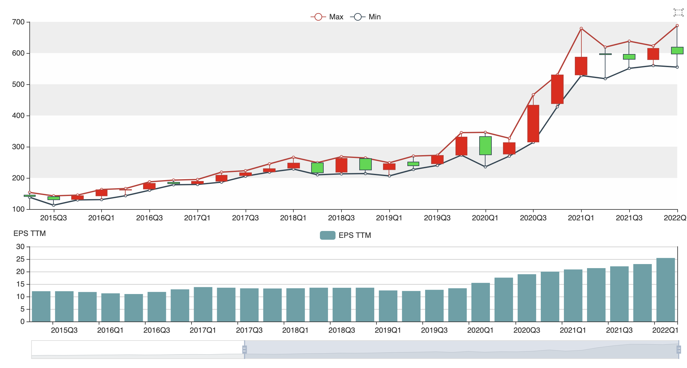
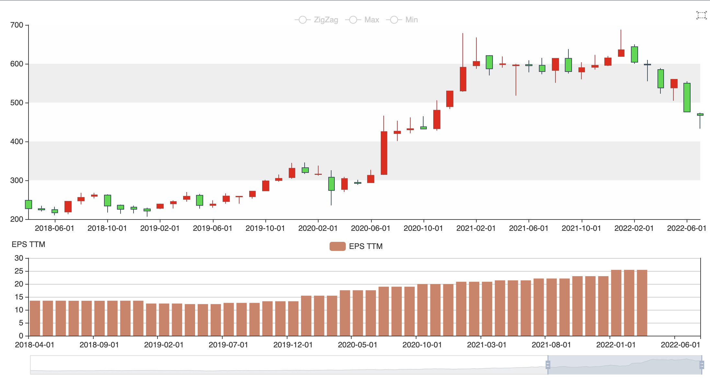
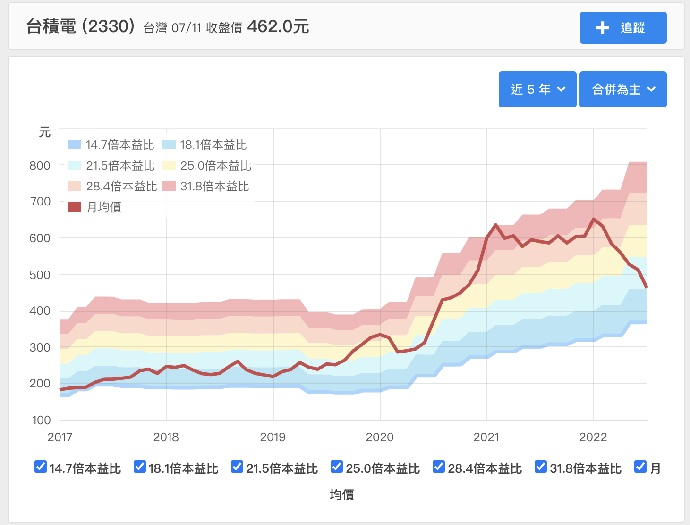

# 自己動手統計台積電金融數據


## 適用對象

對象：投資者與研究者
工具：excel, python + pandas
excel：基本使用
python：必須有基本基礎


## 資料來源

本範例所有資料來源全部透過公開資料收集，透過整理處理過後無法100%確定完全無誤，所有的投資務必依照自己的風險與事實判斷，所有數據僅供參考使用。

交易數據：[台灣證券交易所](https://www.twse.com.tw/) 
財報資料：[公開資訊觀測站](https://mops.twse.com.tw/mops/web/index)


## 數據說明

### 1. 交易數據：交易量以股為單位。

```csv
symbol,exchange,interval,datetime,open,high,low,close,volume,turnover,transaction,open_interest
2330,twse,d,2022-07-08 00:00:00,470.0,470.5,461.5,467.0,39134398,0,46039,0
2330,twse,d,2022-07-07 00:00:00,442.0,459.0,438.5,457.5,50984110,0,56227,0
2330,twse,d,2022-07-06 00:00:00,442.0,447.5,435.0,435.5,42156925,0,59018,0
2330,twse,d,2022-07-05 00:00:00,449.5,451.5,433.0,446.0,55469884,0,70715,0
```


### 2. 財務報表數據

將三大財務報表報整理成為一個總報表，在每季財務報表中，已經轉換成當季數據，可以個別判斷或統計各項數據。例如營業收入第三季財務數據是一到三季總和，將第三季數據減去第二季數據，就可以得到第三季實際營業收入數據。


```csv
quarter,營業收入,營業成本,營業毛利,營業費用,推銷費用,管理費用,研究發展費用,營業利益,營業外收入及支出,稅前淨利,淨利,合併淨利,毛利率,所得稅費用,合併淨利率,母公司淨利,非母公司淨利,每股盈餘,現金及約當現金,應付帳款,應收帳款,存貨,流動資產,資產總計,合約負債,流動負債,負債總計,資本公積,法定盈餘公積,特別盈餘公積,保留盈餘,普通股股本,股本,普通股數,權益總計,負債及權益總計,現金CF,營業活動,折舊費用,攤銷費用,合約負債增減,融資活動,已付股利,投資活動,廠房及設備投資活動,淨現金流,淨值,現金股利,datetime,start,end,year,ns
2012Q1,105614831000.0,55210347000.0,50404484000.0,14915291000.0,1100435000.0,4657004000.0,9157852000.0,35117313000.0,555741000.0,35673054000.0,33382936000.0,31080988000.0,0.4772481622396385,2290118000.0,0.2942862068301752,33491634000.0,-108698000.0,1.29,143472277000.0,10530487000.0,45830288000.0,24840582000.0,224392169000.0,779550815000.0,0,122074950000.0,149622170000.0,55471662000.0,102399995000.0,6433874000.0,320464327000.0,259162226000.0,259162226000.0,25916222600.0,629928645000.0,,170819939000.0,56101634000.0,27477221000.0,528186000.0,0,20596856000.0,0.0,-47757582000.0,-48570613000.0,27347662000.0,24.30634489919839,-0.0,2012-01-01,2012-01-01,2012-03-31,2012,1325347200000000000
2012Q2,128186331000.0,65579011000.0,62607320000.0,15538069000.0,1104741000.0,4364938000.0,10068390000.0,46872088000.0,-915157000.0,45956931000.0,41799616000.0,44248125000.0,0.4884087056052801,4157315000.0,0.3451859855478663,41843339000.0,-43723000.0,1.61,178440559000.0,14126994000.0,60610432000.0,30780466000.0,284584019000.0,890590164000.0,0,218355100000.0,262652910000.0,55596476000.0,115820123000.0,7606224000.0,318050632000.0,259207094000.0,259207094000.0,25920709400.0,627937254000.0,,178440559000.0,68667099000.0,31900131000.0,560700000.0,0,-4508096000.0,0.0,-57279337000.0,-59467478000.0,7620620000.0,24.22531128719803,-0.0,2012-04-01,2012-04-01,2012-06-30,2012,1333209600000000000
2012Q3,141499253000.0,72344501000.0,69154752000.0,16370354000.0,1234982000.0,4478517000.0,10656855000.0,52797978000.0,964363000.0,53762341000.0,49422294000.0,47121878000.0,0.488728742617461,4340047000.0,0.333018563709308,49379633000.0,42661000.0,1.9,138738113000.0,13773108000.0,64386937000.0,33249045000.0,249575097000.0,885771436000.0,0,125952667000.0,210684119000.0,55630425000.0,115820123000.0,7606224000.0,367430265000.0,259220476000.0,259220476000.0,25922047600.0,675087317000.0,,138738113000.0,75395863000.0,34124335000.0,553718000.0,0,-39313949000.0,-77748668000.0,-74510237000.0,-78333589000.0,-39702446000.0,26.04297806319899,2.999325871155333,2012-07-01,2012-07-01,2012-09-30,2012,1341072000000000000
```


## 產生各項統計數據


有了兩個重要數據接下來就來產生各種統計數據，大家可以透過 excel 統計出以下數據，但是這次我要採用 python 程式語言 + pandas 來協助統計數據，把 pandas 想像成程式語言世界的 excel， excel 裡面可以呈現出來的表格，在 pandas 都可以產生數據，更加複雜的技術指標透過 python + pandas 都可以完成。


### pandas 入門課

**匯入csv檔案**

```python
bardf = pd.read_csv("bars.csv")
bardf['datetime'] = pd.to_datetime(bardf['datetime']) # 轉換成日期格式
bardf.index = bardf['datetime']                       # 設定index
print(bardf.head())
```


datetime, symbol, exchange, interval, datetime, open, high, low, close, volume....這些是列項目名稱，使用方法為 bardf['volume'] 或是 bardf.volume 。這就像在 excel 裡面選取 volume 裡面所有資料。第一個 datetime 就是 index，使用方法為 bardf.index。

```code
            symbol exchange interval   datetime   open   high    low  close    volume  turnover  transaction  open_interest
datetime
2022-07-08    2330     twse        d 2022-07-08  470.0  470.5  461.5  467.0  39134398       0.0        46039              0
2022-07-07    2330     twse        d 2022-07-07  442.0  459.0  438.5  457.5  50984110       0.0        56227              0
2022-07-06    2330     twse        d 2022-07-06  442.0  447.5  435.0  435.5  42156925       0.0        59018              0
2022-07-05    2330     twse        d 2022-07-05  449.5  451.5  433.0  446.0  55469884       0.0        70715              0
2022-07-04    2330     twse        d 2022-07-04  443.0  451.5  440.0  440.0  61206245       0.0        96760              0
```


**各項指標**

1. 五日線5SMA, 月線20SMA, 季線60SMA
```python
bardf['5sma'] = bardf['close'].rolling(window=5).mean()
bardf['20sma'] = bardf['close'].rolling(window=20).mean()
bardf['60sma'] = bardf['close'].rolling(window=60).mean()
```

2. 每日漲跌幅

方法一
```python
bardf['change'] = bardf['close'].pct_change() # pct_change() 計算每日變化比例
```

方法二
```python
day = bardf['close'].shift(1)                 # 將收盤價往後移位一日, 就是前一日收盤價
bardf['change2'] = (day - bardf['close'])/day


# 檢查數據
v = (bardf['change'] == bardf['change2'])     # 判斷兩列表格是否相等, 結果會產生 True,False 表格列
r = v[0:].all()                               # 表格列取出所有數據`[0:]`, 再用.all()判斷, 表格列要全部是 True 結果才會是 True
print(r)
```

**參考資料**
更多技術分析指標 [pandas_ta](https://github.com/twopirllc/pandas-ta)


### 每季統計數據

```python
findf = pd.read_csv("quarter.csv")
findf.index = findf['quarter']
sel = ['quarter','start','end', '營業收入','營業成本','營業毛利']
print(findf[sel].head())
```

因為資料有過多的欄位，不好閱讀挑選幾個想要顯示的欄位後，將它print出來
```code
        quarter       start         end          營業收入          營業成本          營業毛利
quarter
2012Q1   2012Q1  2012-01-01  2012-03-31  1.056148e+11  5.521035e+10  5.040448e+10
2012Q2   2012Q2  2012-04-01  2012-06-30  1.281863e+11  6.557901e+10  6.260732e+10
2012Q3   2012Q3  2012-07-01  2012-09-30  1.414993e+11  7.234450e+10  6.915475e+10
2012Q4   2012Q4  2012-10-01  2012-12-31  1.314448e+11  6.944924e+10  6.199558e+10
2013Q1   2013Q1  2013-01-01  2013-03-31  1.327550e+11  7.198873e+10  6.076627e+10
```


**簡單的財報計算**

營業毛利 GrossProfit
```python
findf['營業毛利'] = findf['營業收入'] - findf['營業成本']
```


推銷管理費用 = 推銷費用 + 管理費用 
營業費用 = 研究發展費用 + 推銷管理費用
```python
findf['推銷管理費用'] = findf['推銷費用'] + findf['管理費用']
findf['營業費用'] = findf['研究發展費用'] + findf['推銷管理費用'] 
```


營業利益 = 營業收入 - 營業成本 - 營業費用
```python
findf['營業利益'] = findf['營業收入'] - findf['營業成本'] - findf['營業費用']
```


**近12月數據**

每股盈餘 TTM
```python
findf['每股盈餘_TTM'] = findf['每股盈餘'].rolling(window=4).sum()
```


**股價本益比, 股價淨值比**

```python
# demo1.py
fin = findf.iloc[-1] # 取出最新一季報表
s = datetime(fin.start.year, fin.start.month, fin.start.day)
e = datetime(fin.end.year, fin.end.month, fin.end.day)
mark = (
    (bardf.datetime >= s) &
    (bardf.datetime <= e )
)
n = bardf[mark]
pe = n['open']/fin['每股盈餘_TTM']
pe_max = n['high']/fin['每股盈餘_TTM']
pe_min = n['low']/fin['每股盈餘_TTM']
pb = n['open']/fin['淨值']
pb_max = n['high']/fin['淨值']
pb_min = n['low']/fin['淨值']


print("季別", fin.quarter , "統計交易日", n.shape[0], s.strftime("%Y%m%d"), "~", e.strftime("%Y%m%d"))
print("本益比平均數", pe.mean(), "本益比最大值", pe_max.max(), "本益比最小值", pe_min.min())
print("淨值比平均數", pb.mean(), "淨值比最大值", pb_max.max(), "淨值比最小值", pb_min.min())

```


產生出來統計數據
```
季別 2022Q1 統計交易日 56 20220101 ~ 20220331
本益比平均數 24.32053009883199 本益比最大值 27.044025157232706 本益比最小值 21.816037735849058
淨值比平均數 6.911294833680723 淨值比最大值 7.685244959364204 淨值比最小值 6.199579872742927
```


基於以上的算式將它寫成一個 function 這樣就可以利用它算出每季的數據。


```python
#demo2.py
def statistics_pepb(df, bardf):
    """
    每天盈餘本益比統計
    2. 每季3,6,9,12月 
    統計區間一
    統計週期: 2022Q1 
    資料日期: 2022-01-01 ~ 2022-03-31
    統計區間二
    統計週期: 2022Q1 
    資料日期: 2022-04-01 ~ 2022-06-31
    2022Q1 前四期eps總和算出 2022Q2 下季的本益比，
    產生的數據會有較大的不準確性，當公司獲利成長轉衰退
    時，等於用較高的eps來算出衰退時候的數據。

    1. 年度
    統計週期: 2021 
    資料日期: 2021-01-01 ~ 2021-12-31
    用 2021 EPS 計算 2021 本益比
    計算出來的數據不連貫, 跨年的時候數據變化過大
    """
    for idx, row in df.iterrows():
        dps = '現金股利'
        eps = '每股盈餘_TTM'
        book = '淨值'
        month = 1

        s = datetime(row.start.year, row.start.month, row.start.day)
        e = datetime(row.end.year, row.end.month, row.end.day)

        mark = (
            (bardf.datetime >= s) &
            (bardf.datetime <= e )
        )
        n = bardf[mark]
        count = n.shape[0]
        if count == 0:
            continue

        # 股價變化
        _o = n.open.iloc[0]
        _h = n.high.max()
        _l = n.low.min()
        _c = n.close.iloc[-1]

        # 本益比淨值比
        _pe = n.close/row[eps]
        _pe_max = n.high/row[eps]
        _pe_min = n.low/row[eps]
        _pb = n.close/row[book]
        _pb_max = n.high/row[book]
        _pb_min = n.low/row[book]
        _pe = _pe[_pe>0]

        sel = df.start == s
        df.loc[sel, '本益比平均數'] = _pe.mean()
        df.loc[sel, '本益比最大值'] = _pe_max.max()
        df.loc[sel, '本益比最小值'] = _pe_min.min()
        df.loc[sel, '淨值比平均數'] = _pb.mean()
        df.loc[sel, '淨值比最大值'] = _pb_max.max()
        df.loc[sel, '淨值比最小值'] = _pb_min.min()
        df.loc[sel, 'open'] = _o
        df.loc[sel, 'high'] = _h
        df.loc[sel, 'low'] = _l
        df.loc[sel, 'close'] = _c

statistics_pepb(findf, bardf)
print(findf[['本益比平均數', '本益比最小值', '淨值比平均數', 'high', 'low']].head(12))
```


以下就是透過上列 function 計算產生的台積電每季的數據

```
         本益比最小值  本益比平均數  淨值比平均數   high    low
quarter
2012Q1      NaN     NaN    3.26  86.50  74.60
2012Q2      NaN     NaN    3.41  89.80  76.10
2012Q3      NaN     NaN    3.14  89.80  73.80
2012Q4    13.16   14.35    3.30  99.40  84.50
2013Q1    14.58   15.32    3.44 109.50  97.10
2013Q2    13.83   15.21    3.73 116.50  97.50
2013Q3    12.99   14.25    3.28 110.00  92.90
2013Q4    13.77   14.48    3.22 111.50 100.00
2014Q1    13.26   14.31    3.31 118.50 100.50
2014Q2    14.72   15.43    3.59 127.00 116.00
2014Q3    13.49   14.22    3.40 138.00 119.00
2014Q4    11.59   13.02    3.28 142.00 118.00
2015Q1    11.42   12.69    3.33 155.00 130.00
2015Q2    11.37   11.94    3.53 153.50 138.00
2015Q3     9.29   10.83    2.95 142.50 112.50
2015Q4    10.96   11.81    2.96 145.00 129.50
2016Q1    11.58   13.07    2.98 163.00 130.50
2016Q2    12.99   14.16    3.38 166.00 143.00
2016Q3    13.57   14.82    3.54 187.50 160.50
2016Q4    13.81   14.33    3.45 193.00 178.00
2017Q1    13.00   13.55    3.32 195.00 179.00
2017Q2    13.78   14.97    3.91 218.50 186.50
2017Q3    15.49   16.18    3.89 223.00 205.50
2017Q4    16.52   17.69    3.99 245.00 218.50
2018Q1    17.17   18.58    3.99 266.00 228.50
2018Q2    15.51   16.93    3.99 249.00 210.00
2018Q3    15.77   18.06    4.02 268.00 213.00
2018Q4    15.81   16.97    3.55 264.00 214.00
2019Q1    16.59   18.44    3.42 248.50 206.50
2019Q2    18.56   20.22    4.13 270.00 227.00
2019Q3    18.91   20.17    4.18 272.50 240.00
2019Q4    20.50   23.15    4.93 345.00 273.00
2020Q1    15.23   20.23    4.84 346.00 235.50
2020Q2    15.38   17.04    4.51 327.00 270.00
2020Q3    16.57   21.69    5.96 466.50 314.00
2020Q4    21.43   23.99    6.71 530.00 428.00
2021Q1    25.32   29.13    8.11 679.00 528.00
2021Q2    24.24   27.70    7.70 619.00 518.00
2021Q3    24.93   26.85    7.40 638.00 551.00
2021Q4    24.34   26.01    7.15 623.00 560.00
2022Q1    21.82   24.32    6.91 688.00 555.00
```


接下來我們將數據轉換成圖示，plotting.plots 這個 function 目的要簡化產生圖表流程，將 bar dataframe 和圖表 dataframe 帶入就可以產生圖表。


```python
#demo3.py 
#執行後開啟demo3.html
charts = []
s = round(findf['本益比最大值']*findf['每股盈餘_TTM'],1)
s.name = 'value'
c = pd.DataFrame(s)
c['chart'] = 'line'     # line or bar
c['label'] = 'Max'      # label
c['isOverlap'] = True   # 是否重疊在股價的圖表上
c['overlap'] = 'main'   # 重疊的圖表名稱, 內定值為`main`
c['showPoint'] = False  # 是否顯示y軸上數值
charts.append(c)

s = round(findf['本益比最小值']*findf['每股盈餘_TTM'],1)
s.name = 'value'
c = pd.DataFrame(s)
c['chart'] = 'line'
c['label'] = 'Min'
c['isOverlap'] = True
c['overlap'] = 'main'
c['showPoint'] = False
charts.append(c)

s = round(findf['每股盈餘_TTM'],2)
s.name = 'value'
c = pd.DataFrame(s)
c['chart'] = 'bar'
c['label'] = 'EPS TTM'
c['isOverlap'] = False
c['overlap'] = ''
c['showPoint'] = False
charts.append(c)

chart = plotting.plots(findf, charts)
chart.render('demo3.html')
```


用每季統計出來的數據，好像沒有參考價值，將統計週期改為**每個月一次**


### 每月統計數據


統計每月數據跟每季數據的流程有些不一樣，**每季統計數據**是採用當季財務報表數據，去選取當季的交易數據，最後匯入當季財報數據中。

至於**每月統計數據**由每日交易數據與財務報表數據來產生每日本益比，第二步將每日數據轉成每月數據，最後再用統計週期數據與每日交易數據，依照統計週期算出本益比。

1. bar + 財務報表 => 計算本益比 => 將資料寫入 bar 
```python
def statistics_bar(bardf, findf , statistics_type=1):
    """
    bar + 財務報表 => 計算本益比 => 將資料寫入 bar
    每天盈餘本益比統計
    2. 每季3,6,9,12月 
    統計區間一
    統計週期: 2022Q1 
    資料日期: 2022-01-01 ~ 2022-03-31
    統計區間二
    統計週期: 2022Q1 
    資料日期: 2022-04-01 ~ 2022-06-31
    2022Q1 前四期eps總和算出 2022Q2 下季的本益比，
    產生的數據會有較大的不準確性，當公司獲利成長轉衰退
    時，等於用較高的eps來算出衰退時候的數據。

    1. 年度
    統計週期: 2021 
    資料日期: 2021-01-01 ~ 2021-12-31
    用 2021 EPS 計算 2021 本益比
    計算出來的數據不連貫, 跨年的時候數據變化過大
    """
    for idx, row in findf.iterrows():
        dps = '現金股利'
        eps = '每股盈餘_TTM'
        book = '淨值'

        if np.isnan(row[eps]):
            continue

        # 
        year = row.datetime.year
        month = row.datetime.month
        # day= 10
        quarter = 3
        sdt = datetime(year, month, 1)
        if month+quarter > 12:
            month = 1
            year=year+1
        else:
            month+=quarter
        edt = datetime(year, month, 1)
        if statistics_type == 2:
            sdt = datetime(year, month, 1)
            if month+quarter > 12:
                month = 1
                year = year+1
            else:
                month+=quarter            
            edt = datetime(year, month, 1)

        mark = (
            (bardf['datetime'] >= sdt) &
            (bardf['datetime'] < edt )
        )
        n = bardf[mark]
        count = n.shape[0]
        if count == 0:
            continue

        _pe = n.close/row[eps]
        _pe_max = n.high/row[eps]
        _pe_min = n.low/row[eps]
        _pb = n.close/row[book]
        _pb_max = n.high/row[book]
        _pb_min = n.low/row[book]
        _yield = n.close/row[dps]
        _pe = _pe[_pe>0]

        # bardf.loc[_yield.index, '殖利率'] = _yield
        bardf.loc[_pb.index, '淨值比'] = _pb
        bardf.loc[_pb.index, '淨值比最大值'] = _pb_max
        bardf.loc[_pb.index, '淨值比最小值'] = _pb_min
        bardf.loc[_pb.index, '淨值'] = row[book]
        bardf.loc[n.index, '每股盈餘_TTM'] = row[eps]
        if _pe.shape[0] == 0:
            bardf.loc[n.index, '本益比'] = np.nan
            bardf.loc[n.index, '本益比最大值'] = np.nan
            bardf.loc[n.index, '本益比最小值'] = np.nan
        else:
            bardf.loc[_pe.index, '本益比'] = _pe
            bardf.loc[_pe.index, '本益比最大值'] = _pe_max
            bardf.loc[_pe.index, '本益比最小值'] = _pe_min
```

2. bar => 轉換 => 每月統計數據
```python
def get_period(bar, period="1W"):
    # bar => 轉換 => 每月統計數據
    # period = 1W週/1M月/1Q季統計
    bar = bar.sort_index()
    s = bar.datetime.iloc[0]
    e = bar.datetime.iloc[-1]

    year = e.year
    month = e.month+1
    if e.month+1>12:
        year+=1
        month=1
    e = datetime(year, month, 1)


    drs = pd.date_range(f'{s.year}-{s.month}-1',f'{e.year}-{e.month}-{e.day}', freq=period)
    o = pd.DataFrame()
    for dt in drs.tolist():
        if period == '1W':
            s = datetime(dt.year, dt.month, dt.day) - timedelta(days=6)
            e = datetime(dt.year, dt.month, dt.day)
        elif period == '1M':
            s = datetime(dt.year, dt.month, 1)
            e = datetime(dt.year, dt.month, dt.day)
        mark = (bar.datetime >= s) & (bar.datetime <= e )
        n = bar[mark]
        if n.shape[0] == 0:
            continue 
        data = {
            'datetime': s,
            'start': s,
            'end': e,
            'price': n.close.mean(),
            'open': n.open.iloc[0],
            'high': n.high.max(),
            'low': n.low.min(),
            'close': n.close.iloc[-1],
            'volume': n.volume.sum(),
            '每股盈餘_TTM': n['每股盈餘_TTM'].iloc[-1]
        }
        t = pd.DataFrame([data])
        o = o.append(t)

    o.index = o.start
    return o

```

3. 統計數據 + 每日數據(bar) => 時間週期計算數據 => 統計數據結果 
```python
def statisitics_period(statdf, bardf, period="1W"):
    # 統計數據 + 每日數據(bar) => 時間週期計算數據 => 統計數據結果 
    # period=1W週/1M月/1Q季統計
    s = statdf.datetime.iloc[0]
    e = statdf.datetime.iloc[-1]

    tdf = pd.date_range(f'{s.year}-{s.month}-1',f'{e.year}-{e.month}-1', freq=period)
    o = pd.DataFrame()
    for dt in tdf.tolist():
        if period == '1W':
            s = datetime(dt.year, dt.month, dt.day) - timedelta(days=6)
            e = datetime(dt.year, dt.month, dt.day)
        elif period == '1M':
            s = datetime(dt.year, dt.month, 1)
            e = datetime(dt.year, dt.month, dt.day)
        elif period == '1Q':
            s = datetime(dt.year, dt.month-2, 1)
            e = datetime(dt.year, dt.month, dt.day)
        mark = (statdf.datetime >= s) & (statdf.datetime <= e)
        n = statdf[mark]
        if n.shape[0] == 0:
            continue

        mark = (bardf.datetime >= s) & (bardf.datetime <= e)
        _bardf = bardf[mark] 
        if _bardf.shape[0] == 0:
            continue

        barrow = _bardf.iloc[-1]
        # 本益比淨值比
        _pe = _bardf.close/barrow['每股盈餘_TTM']
        _pe_max = _bardf.high/barrow['每股盈餘_TTM']
        _pe_min = _bardf.low/barrow['每股盈餘_TTM']
        _pb = _bardf.close/barrow['淨值']
        _pb_max = _bardf.high/barrow['淨值']
        _pb_min = _bardf.low/barrow['淨值']
        _pe = _pe[_pe>0]

        # 統計數據結果
        sel = (statdf.start >= s) & (statdf.start <= e)
        statdf.loc[sel, '本益比平均數'] = _pe.mean()
        statdf.loc[sel, '本益比最大值'] = _pe_max.max()
        statdf.loc[sel, '本益比最小值'] = _pe_min.min()
        statdf.loc[sel, '淨值比平均數'] = _pb.mean()
        statdf.loc[sel, '淨值比最大值'] = _pb_max.max()
        statdf.loc[sel, '淨值比最小值'] = _pb_min.min()
    return statdf
```


在demo4.py範例中採用季區間，最後就會看到下圖



當我看到這張圖表時，感覺好像河流圖，河流圖也是用月做統計，馬上把財報狗的河流圖拿來比對。


圖片來源[財報狗](https://statementdog.com/analysis/2330/pb-band)


### 台積電本益比幾倍才合理？ 

統計**本益比的合理倍數**，想到了採用**年平均**或是**n年平均值**或者是**每日平均值**等等，想到的公式非常的多，先用每日平均值來統計，並且也把**每股盈餘**加入比較，也算算YoY等數據，要算最近12個月的每股盈餘，把進四季的盈餘加總，這是毫無疑問的答案，但是要算 YoY 就有兩種，第一種跟**上一季的近12月**比較，或是跟**同季前一年度近12月**比較。


```python
# demo5.py
sel = [
    '每股盈餘_AVG_3YEAR','每股盈餘_AVG_5YEAR','每股盈餘_TTM','每股盈餘_TTM_YoY', 
    '本益比最小值', '本益比平均數_TTM', '本益比平均數_TTM_YoY'
]
display_cols = ['EPS:AVG 3YEAR','5YEAR','__TTM','__YoY','PE:最小值','AVG TTM','__YoY']
#
# 每季YoY數據
#
qdf['每股盈餘_TTM_YoY'] = qdf['每股盈餘_TTM'].pct_change()
qdf['本益比平均數_TTM'] = qdf['本益比平均數'].rolling(window=4).mean()
qdf['本益比平均數_TTM_YoY'] = qdf['本益比平均數_TTM'].pct_change()

n = qdf[sel]
n['每股盈餘_TTM_YoY'] = n['每股盈餘_TTM_YoY']*100
n['本益比平均數_TTM_YoY'] = n['本益比平均數_TTM_YoY']*100
n.columns = display_cols
count = n.shape[0]
print(n[count-21:count])
```


```python
#
# 前12月YoY數據
#
qdf['每股盈餘_TTM_YoY'] = (qdf['每股盈餘_TTM']-qdf['每股盈餘_TTM'].shift(4))/qdf['每股盈餘_TTM'].shift(4)
qdf['本益比平均數_TTM'] = qdf['本益比平均數'].rolling(window=4).mean()
qdf['本益比平均數_TTM_YoY'] = (qdf['本益比平均數_TTM']-qdf['本益比平均數_TTM'].shift(4))/qdf['本益比平均數_TTM'].shift(4)

mark = (qdf.Q == qdf.Q.iloc[-1])
n = qdf[mark][sel]
n['每股盈餘_TTM_YoY'] = n['每股盈餘_TTM_YoY']*100
n['本益比平均數_TTM_YoY'] = n['本益比平均數_TTM_YoY']*100
n.columns = display_cols
count = n.shape[0]
print(n[count-6:count])
```


上半部是用季YoY，下半部前一個季度YoY
```
欄位說明
EPS:AVG 3YEAR= EPS平均值（三年） 
5YEAR        = EPS平均值（五年）
__TTM        = EPS平均值（近四季）
__YoY        = EPS每季YoY/前12月YoY
PE:最小值     = 本益比最小值（季度）
AVG TTM      = 本益比平均值（近四季） 
__YoY        = 本益比每季YoY/前12月YoY
```
```
         EPS:AVG 3YEAR  5YEAR  __TTM  __YoY  PE:最小值  AVG TTM  __YoY
quarter
2017Q1           12.14  10.13  13.77   6.83   13.00    14.22   0.86
2017Q2           12.23  10.32  13.53  -1.74   13.78    14.42   1.42
2017Q3           12.40  10.64  13.27  -1.92   15.49    14.76   2.37
2017Q4           12.65  11.08  13.23  -0.30   16.52    15.60   5.70
2018Q1           12.78  11.46  13.31   0.60   17.17    16.86   8.06
2018Q2           12.69  11.62  13.54   1.73   15.51    17.35   2.90
2018Q3           12.87  11.91  13.51  -0.22   15.77    17.82   2.71
2018Q4           13.22  12.33  13.54   0.22   15.81    17.64  -1.01
2019Q1           13.18  12.44  12.45  -8.05   16.59    17.60  -0.20
2019Q2           13.10  12.49  12.23  -1.77   18.56    18.42   4.68
2019Q3           13.16  12.68  12.69   3.76   18.91    18.95   2.86
2019Q4           13.36  12.96  13.32   4.96   20.50    20.49   8.15
2020Q1           13.74  13.25  15.46  16.07   15.23    20.94   2.18
2020Q2           14.44  13.57  17.55  13.52   15.38    20.15  -3.79
2020Q3           15.05  14.05  18.95   7.98   16.57    20.53   1.89
2020Q4           15.61  14.59  19.97   5.38   21.43    20.74   1.03
2021Q1           16.25  15.17  20.85   4.41   25.32    22.96  10.73
2021Q2           17.05  15.64  21.37   2.49   24.24    25.63  11.60
2021Q3           17.91  16.10  22.10   3.42   24.93    26.92   5.04
2021Q4           18.77  16.61  23.01   4.12   24.34    27.42   1.88
2022Q1           20.58  17.50  25.44  10.56     NaN      NaN   0.00
         EPS:AVG 3YEAR  5YEAR  __TTM  __YoY  PE:最小值  AVG TTM  __YoY
quarter
2017Q1           12.14  10.13  13.77  22.18   13.00    14.22  19.34
2018Q1           12.78  11.46  13.31  -3.34   17.17    16.86  18.59
2019Q1           13.18  12.44  12.45  -6.46   16.59    17.60   4.41
2020Q1           13.74  13.25  15.46  24.18   15.23    20.94  18.97
2021Q1           16.25  15.17  20.85  34.86   25.32    22.96   9.66
2022Q1           20.58  17.50  25.44  22.01     NaN      NaN    NaN
```


至於要如何估算出合理的本益比，本益比平均數是採用**每天收盤價**除**近12個月每股盈餘總和**算出本益比的平均值，假如用最高價與最低價來當分子，算出來的數值跟收盤價相差不多，所以**每日本益比平均數**就採用收盤價計算即可。這有一個小盲點，以台積電來看當行情好的時候，因為一季約60交易日，本益比平均數會變得比較小，反之空頭的時候在 2020Q1 近四季本益比平均值 20.94，最小值 15.23，也無法看到極端情況下的本益比數值。

```
2020Q1    15.23   20.23 # 最小值, 每日平均(當季) 
2020Q1    15.23   20.94 # 最小值, 每日平均(近四季)
```


依照目前每季數據來看，要再統計出不同的本益比數據也是太多種，但是哪一種比較有參考性質呢？


**統計本益比倍數次數**

這時候想到了換另一個方式來取本益比，我將每日收盤價的本益比無條件捨取法，只取整數倍數，最後統計哪一個倍數是最多交易日

```python
# demo6.py
bardf['PE'] = [ math.floor(v) if str(v) != 'nan' else 'nan' for v in bardf['本益比'].tolist()]
operations = {'PE':'count'}
t = bardf.groupby('PE').agg(operations)
t.columns = ['days']
t = t.drop('nan', axis=0)
t = t.reset_index()
print(t)
```

```code
    PE  days
0    9     2
1   10    35
2   11   124
3   12   119
4   13   255
5   14   369
6   15   267
7   16   205
8   17   135
9   18   116
10  19   110
11  20    74
12  21    59
13  22    85
14  23    48
15  24    37
16  25    69
17  26    94
18  27    46
19  28    50
20  29    13
21  30     8
22  31     5
23  32     1
```

2012Q3到2022Q1，市場給出的13-16約較合理，最極端的情況下32倍只有一個交易日，買到32倍遇到估值修正，回檔的幅度就會非常的大，大幅度的回檔心理承受的壓力可不小。這個數據結果比較簡單明瞭這是個不錯的統計方式。


## 常用名詞
TTM   近12個月數據


## 程式碼與數據

本篇著重在數據的產生方式，相關數據與程式碼都公開在 [github](https://6u3m.github.io/statistics-2330)，只要準備相同的數據就可以產生統計結果。

必須數據
每日交易:日期,開盤,最高價,最低價,收盤價 (bar.csv)
財務報表:每季EPS (quarter.csv)


## 後記

本篇的起源是要透過數據找出就合理的本益比，嘗試著想像本益比河流圖是用了哪些數據產生出來的，當用使用月統計出數據繪出圖表時，發現它其實就是月線加上本益比，而本益比倍數該如何取得，這來來回回有太多種可能信，最後想到用每日交易的本益比還估算，對我來說這是一個簡單又方便的統計數據。

下一篇介紹對於統計出來後的數據，用什麼角度觀察數據。


2022-07-15 by 6u3m